<!-- Animated Contribution Graph: Scraped directly from GitHub and refreshed daily by GitHub Actions cron -->
<h3><code>wasim@github ~ $ ./contributions.sh</code></h3>

  

<!-- Neofetch Terminal System Card with Animated Photo, Falling Snow Particles, and Neon Glow -->
<h3><code>wasim@github ~ $ neofetch</code></h3>

  

<!-- Terminal ASCII Art Portrait (Typewriter SMIL animation) -->

  
<b><code>wasim@github ~ $ cat ./ascii_portrait.art</code> (Click to expand ASCII Art)</b>

   
  

 

  
  
  

